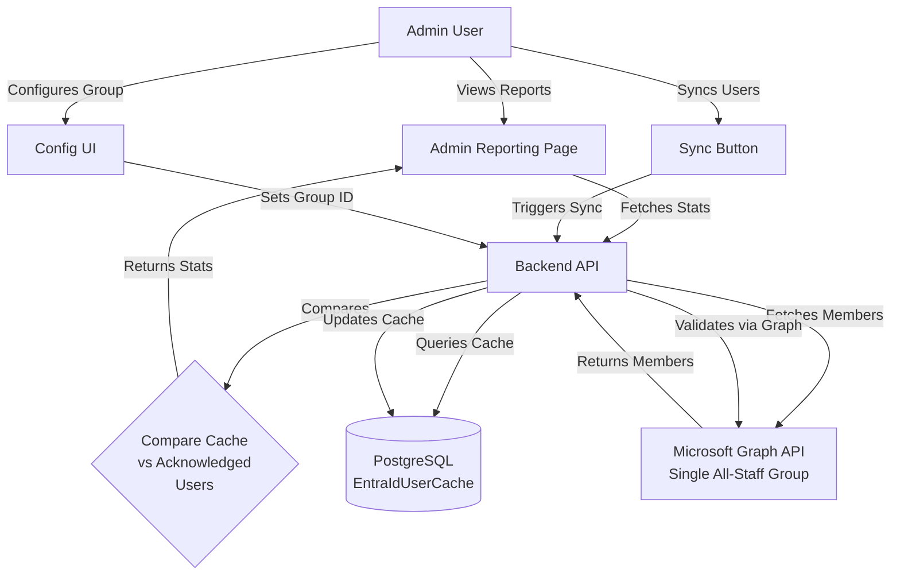

# Document Acknowledgment Reporting and Entra ID Integration

## Overview

Enhance the document acknowledgment system with comprehensive administrative reporting and Microsoft Entra ID integration using a **single "all staff" group** model. This will allow administrators to:

- View acknowledgment status across all documents requiring acknowledgment
- See who has/hasn't acknowledged each document version (including users who haven't logged in yet)
- Track when acknowledgments were required vs when they were completed
- Configure one Entra ID group (e.g., "All Payrolled Staff") to represent all staff
- View accurate acknowledgment statistics using cached Entra ID user data

## Architecture



**Key Design Decisions**:

- **Single group model**: One Entra ID group represents "all staff" (e.g., "All Payrolled Staff")
- **Cache-first approach**: `EntraIdUserCache` is the primary source of truth for staff population
- **Application tokens preferred**: Backend-managed tokens for sync operations (more reliable than delegated tokens)
- **Pagination support**: All user list endpoints support pagination for large staff populations

## Database Schema Changes

### 1. Add Entra ID Configuration Table (Singleton)

**File**: `backend/prisma/schema.prisma`

Add singleton model to store the single "all staff" Entra ID group configuration:

```prisma
model EntraIdConfig {
  id          String    @id @default(uuid())
  groupId     String    @unique  // Entra ID group object ID
  groupName   String    // Display name (cached from Graph API)
  lastSyncedAt DateTime? // When members were last synced (nullable initially)
  createdAt   DateTime  @default(now())
  updatedAt   DateTime  @updatedAt
}
```

**Note**: This table should contain at most one row. Application logic enforces singleton behavior.

### 2. Add Entra ID User Cache Table

**File**: `backend/prisma/schema.prisma`

Add model to cache Entra ID group members for performance:

```prisma
model EntraIdUserCache {
  id              String   @id @default(uuid())
  entraObjectId   String   @unique  // Entra ID object ID
  email           String
  displayName     String
  lastSyncedAt    DateTime @default(now())
  createdAt       DateTime @default(now())
  updatedAt       DateTime @updatedAt

  @@index([email])
}
```

**Key Points**:

- No `groupIds` array - all cached users belong to the single all-staff group
- Represents "all users that should acknowledge documents"
- Email index for efficient lookups when matching with acknowledgment records

**Migration**: Generate migration with `npm run db:migrate -- --name add_entra_id_config_and_cache`

## Backend Implementation

### 1. Create Microsoft Graph Service for Single Group Operations

**File**: `backend/src/services/entraIdService.ts` (new file)

Create service to interact with Microsoft Graph API for the single all-staff group:

**Core Methods**:

- `getGroupById(groupId: string, accessToken: string)`: Get group details (name, etc.)
  - Validates group exists
  - Returns group metadata

- `getAllStaffMembers(groupId: string, accessToken: string)`: Fetch all (transitive) members of the configured group
  - **Implements proper paging**: Uses `$skip` and `$top` or follows `@odata.nextLink` for large groups
  - **Handles throttling**: Implements exponential backoff on 429 responses
  - **Transitive membership**: Uses `/groups/{groupId}/transitiveMembers` endpoint to include nested groups
  - Returns array of user objects: `{ id, email, displayName }`

- `syncAllStaffMembersToCache(groupId: string, accessToken: string)`: Sync group members to cache
  - Calls `getAllStaffMembers()` with paging
  - Upserts rows in `EntraIdUserCache` keyed by `entraObjectId`
  - Updates `EntraIdConfig.lastSyncedAt` on success
  - Handles errors gracefully (partial sync, retry logic)

**Error Handling**:

- Graph API throttling (429): Exponential backoff with max retries
- Transient errors: Retry with jitter
- Invalid group ID: Clear error message
- Large groups: Progress logging for long-running syncs

**Dependencies**: Use existing `@microsoft/microsoft-graph-client` package

**Token Management**:

- Prefer application permissions with server-side token acquisition (client credentials flow)
- Fallback to delegated token if application permissions not available
- Document token requirements clearly

### 2. Enhance Acknowledgment Stats Endpoint

**File**: `backend/src/routes/acknowledgments.ts`

Enhance existing `/api/acknowledgments/stats` endpoint:

**Current behavior**: Only counts users who have logged in (exist in `User` table)

**New behavior**:

- **Primary source**: `EntraIdUserCache` table (represents all staff who should acknowledge)
- Fetch all cached Entra ID users
- For each document requiring acknowledgment:
  - Get all acknowledgments for current document version
  - Match acknowledgments to cached users (by `entraObjectId` or `email`)
  - Calculate acknowledged vs not acknowledged
  - Compute `daysSinceRequired` using `lastChangedDate` or `updatedAt` when version changed
- Return enhanced statistics

**Acknowledgment Required Date Logic**:

- Use `document.lastChangedDate` if set (when version was updated)
- Fallback to `document.updatedAt` if `lastChangedDate` is null
- Calculate `daysSinceRequired` as: `Math.floor((now - requiredDate) / (1000 * 60 * 60 * 24))`

**Percentage Calculation**:

- `percentage = (acknowledgedCount / totalUsers) * 100`
- Round to 2 decimal places: `Math.round(percentage * 100) / 100`
- Handle division by zero (return 0 if `totalUsers === 0`)

**Response format**:

```typescript
{
  dataAsOf: string; // ISO timestamp from EntraIdConfig.lastSyncedAt
  documents: [{
    documentId: string;
    documentTitle: string;
    documentVersion: string;
    requiresAcknowledgement: boolean;
    lastChangedDate: string | null; // When acknowledgment was required
    totalUsers: number; // Count from EntraIdUserCache
    acknowledgedCount: number;
    notAcknowledgedCount: number;
    percentage: number; // Rounded to 2 decimal places
    acknowledgedUsers: [{
      userId?: string; // May be null if user hasn't logged in
      entraObjectId: string;
      email: string;
      displayName: string;
      acknowledgedAt: string;
      daysSinceRequired: number;
    }];
    notAcknowledgedUsers: [{
      userId?: string; // May be null if user hasn't logged in
      entraObjectId: string;
      email: string;
      displayName: string;
      daysSinceRequired: number;
    }];
  }];
  summary: {
    totalDocuments: number;
    totalUsers: number; // From EntraIdUserCache
    averageAcknowledgmentRate: number; // Average percentage across documents
  };
}
```

**Query Parameters**:

- `documentId` (optional): Filter to specific document
- `limit` (optional): Limit number of documents returned (default: all)
- `includeUsers` (optional, boolean): Include full user lists (default: true, set false for performance)

### 3. Add Entra ID Configuration Endpoints

**File**: `backend/src/routes/acknowledgments.ts`

**GET `/api/acknowledgments/entra-config`** - Get configured all-staff group

- Returns: `{ groupId: string | null, groupName: string | null, lastSyncedAt: string | null }`
- Returns `null` values if not configured
- Protected: `requireRole('ADMIN', 'EDITOR')`

**POST `/api/acknowledgments/entra-config`** - Set/update all-staff group

- Body: `{ groupId: string }`
- Validates group exists via Graph API (requires `x-graph-token` header)
- Fetches group name from Graph API
- Creates or updates singleton `EntraIdConfig` record
- Returns: `{ groupId: string, groupName: string, lastSyncedAt: string | null }`
- Protected: `requireRole('ADMIN')`
- Requires `x-graph-token` header for validation

**Note**: Group search functionality deferred to future enhancement. Admin must know the group ID.

### 4. Add User Sync Endpoint

**File**: `backend/src/routes/acknowledgments.ts`

**POST `/api/acknowledgments/entra-sync`** - Sync all-staff group members to cache

- Reads `groupId` from `EntraIdConfig`
- Validates group is configured (returns error if not)
- Calls `entraIdService.syncAllStaffMembersToCache()`
- Uses `x-graph-token` header (prefer application token)
- Returns: `{ synced: number, lastSyncedAt: string }` (number of users synced)
- Protected: `requireRole('ADMIN')`
- Requires `x-graph-token` header

**Error Handling**:

- No group configured: Return 400 with clear message
- Graph API errors: Return 500 with error details
- Partial sync: Log warnings but return success with count

### 5. Add Detailed Document Acknowledgment Endpoint

**File**: `backend/src/routes/acknowledgments.ts`

**GET `/api/acknowledgments/document/:documentId`** - Get detailed acknowledgment status for a specific document

- Returns same format as stats endpoint but for single document
- **Supports pagination** for user lists:
  - Query params: `page` (default: 1), `pageSize` (default: 50, max: 200)
  - Returns: `{ document: {...}, acknowledgedUsers: [...], notAcknowledgedUsers: [...], pagination: { page, pageSize, total } }`
- Protected: `requireRole('ADMIN', 'EDITOR')`

**Performance Considerations**:

- For large staff populations, pagination is essential
- Consider adding indexes on `Acknowledgment.documentId` and `Acknowledgment.documentVersion` if not present

### 6. Update Existing Stats Endpoint

**File**: `backend/src/routes/acknowledgments.ts`

Modify existing `/api/acknowledgments/stats` endpoint:

- Add optional query parameter `documentId` to filter by specific document
- Use `EntraIdUserCache` as primary source (not live Graph API calls)
- Include `dataAsOf` field from `EntraIdConfig.lastSyncedAt`
- Include `lastChangedDate` in calculations for "days since required"
- Return enhanced response format as described above
- Add `includeUsers` parameter to control whether full user lists are returned (performance optimization)

## Frontend Implementation

### 1. Create Admin Acknowledgment Reporting Page

**File**: `frontend/src/pages/AcknowledgmentReportingPage.tsx` (new file)

Create comprehensive reporting page with:

**Main View - Document Overview Table**:

- Columns: Document Title, Version, Required Date, Total Users, Acknowledged, Not Acknowledged, Percentage, Actions
- Sortable columns (click headers to sort)
- Filter by document type, date range
- Search by document title
- Click on row to drill down to user details
- Show "Data as of {lastSyncedAt}" prominently at top
- Highlight rows with percentage < 80% (warning color)

**Drill-Down View - User Details Modal/Page**:

- Show list of all users who should acknowledge
- Two tabs: "Acknowledged" and "Not Acknowledged"
- For acknowledged: Show acknowledgment date, days since required
- For not acknowledged: Show days since required, highlight overdue (>30 days in red)
- **Pagination**: For large user lists, show pagination controls
- Export to CSV functionality (exports current page or all data)
- Filter/search users by name or email
- Sort by acknowledgment date, days since required, name

**Summary Cards**:

- Total documents requiring acknowledgment
- Total users (from Entra ID group, show "Data as of {lastSyncedAt}")
- Overall acknowledgment rate (average percentage)
- Documents with <80% acknowledgment rate (warning count)

**Features**:

- Real-time data refresh button
- Export to CSV (all data or filtered)
- Date range filtering for "Required Date"
- Loading states and error handling

**UI Clarifications**:

- Clearly label "Total users" as "All staff from configured Entra ID group"
- Show sync status and last sync time prominently
- Link to configuration page if group not configured

### 2. Create All Staff Group Configuration Component

**File**: `frontend/src/components/AllStaffGroupConfig.tsx` (new file)

Simple component for managing single all-staff group configuration:

**Display Current Configuration**:

- Show current `groupName` and `groupId` (if configured)
- Show "Last synced: {lastSyncedAt}" timestamp
- Show sync status (synced, never synced, error)

**Configuration Form**:

- Input field for `groupId` (Entra ID group object ID)
- "Set Group" button to save configuration
- Validates group exists (requires Graph token)
- Shows group name after validation

**Sync Controls**:

- "Sync Users Now" button (triggers `/entra-sync`)
- Shows sync progress/loading state
- Displays sync result (number of users synced)
- Error handling with clear messages

**Status Indicators**:

- Green: Group configured and synced recently (< 7 days)
- Yellow: Group configured but sync is stale (> 7 days)
- Red: Group not configured or sync failed
- Gray: Never synced

**Note**: Group search UI deferred to future enhancement. Admin must know the group ID.

### 3. Update Routes

**File**: `frontend/src/App.tsx`

Add new routes:

```typescript
<Route
  path="/admin/documents/acknowledgments/reporting"
  element={
    <ProtectedRoute requiredRole="EDITOR">
      <Layout>
        <AcknowledgmentReportingPage />
      </Layout>
    </ProtectedRoute>
  }
/>

<Route
  path="/admin/documents/acknowledgments/config"
  element={
    <ProtectedRoute requiredRole="ADMIN">
      <Layout>
        <AllStaffGroupConfig />
      </Layout>
    </ProtectedRoute>
  }
/>
```

### 4. Update Navigation

**File**: `frontend/src/components/Layout.tsx`

Add links in navigation menu (under Documents section):

- "Acknowledgment Reporting" → `/admin/documents/acknowledgments/reporting`
- "Acknowledgment Config" (Admin only) → `/admin/documents/acknowledgments/config`

### 5. Create API Service Methods

**File**: `frontend/src/services/api.ts` (or create `frontend/src/services/acknowledgmentService.ts`)

Add methods:

- `getAcknowledgmentStats(documentId?: string, includeUsers?: boolean)`: Fetch acknowledgment statistics
- `getDocumentAcknowledgmentDetails(documentId: string, page?: number, pageSize?: number)`: Get detailed status for one document with pagination
- `getEntraIdConfig()`: Get configured all-staff group
- `setEntraIdConfig(groupId: string)`: Set all-staff group (requires Graph token header)
- `syncEntraIdUsers()`: Sync user cache (requires Graph token header)

**Graph Token Handling**:

- Methods that require Graph token should accept optional `graphToken` parameter
- Frontend can get token via `authService.getGraphAccessToken(['GroupMember.Read.All', 'Group.Read.All'])`

## Microsoft Graph API Permissions

**Required Permissions**:

**Application Permissions** (Preferred for sync operations):

- `GroupMember.Read.All` - Read group members (including transitive)
- `Group.Read.All` - Read group information

**Delegated Permissions** (Fallback if application permissions not available):

- `GroupMember.Read.All` - Read group members
- `Group.Read.All` - Read group information

**Note**:

- Application permissions require admin consent
- Application permissions allow server-side token acquisition (client credentials flow)
- Delegated permissions require user consent and use user's token
- Document permission setup in deployment guide

**Recommended Setup**:

1. Add application permissions to Azure AD app registration
2. Grant admin consent
3. Use application token for sync operations (more reliable, no user interaction)
4. Use delegated token only if application permissions unavailable

## Scheduled Sync Job (Recommended)

**Implementation**: Add scheduled job to sync Entra ID users automatically

**Options**:

1. **Cron job** (server-side): Use `node-cron` or similar to run sync daily/weekly
2. **AWS EventBridge** (if deployed on AWS): Schedule Lambda or ECS task
3. **GitHub Actions** (CI/CD): Scheduled workflow that calls sync endpoint

**Recommendation**: Daily sync at off-peak hours (e.g., 2 AM)

**Benefits**:

- Keeps cache fresh without manual intervention
- Ensures accurate reporting
- Reduces load on Graph API (batch sync vs per-request)

**Documentation**: Include setup instructions in deployment guide

## Testing Considerations

### Backend Tests

**Entra ID Service Tests** (`backend/src/services/__tests__/entraIdService.test.ts`):

- Test `getGroupById()` with valid/invalid group IDs
- Test `getAllStaffMembers()` with paging (mock multiple pages)
- Test throttling handling (429 responses with retry)
- Test transitive membership fetching
- Test `syncAllStaffMembersToCache()` with large groups (1000+ users)
- Test error scenarios (network failures, invalid tokens)

**Acknowledgment Stats Tests** (`backend/src/routes/__tests__/acknowledgments.test.ts`):

- Test stats calculation with Entra ID cache as primary source
- Test matching acknowledgments to cached users (by `entraObjectId` and `email`)
- Test `daysSinceRequired` calculation using `lastChangedDate`
- Test percentage rounding (2 decimal places)
- Test users who have never logged in (no `userId` in response)
- Test pagination for document details endpoint
- Test `includeUsers=false` parameter

**Config Endpoints Tests**:

- Test GET `/entra-config` returns null when not configured
- Test POST `/entra-config` validates group exists
- Test POST `/entra-sync` fails gracefully when no group configured
- Test singleton behavior (only one config record)

**Edge Cases**:

- Empty Entra ID group (no members)
- Very large groups (10,000+ members) with paging
- Users removed from group (stale cache entries)
- Division by zero in percentage calculation

### Frontend Tests

**Reporting Page Tests** (`frontend/src/pages/__tests__/AcknowledgmentReportingPage.test.tsx`):

- Test document table renders with mock data
- Test sorting by columns
- Test filtering by document type
- Test search functionality
- Test drill-down modal shows user details
- Test pagination controls for user lists
- Test CSV export functionality
- Test highlighting of low acknowledgment rates (<80%)
- Test "Data as of" timestamp display
- Test error states (no group configured, sync failed)

**Config Component Tests** (`frontend/src/components/__tests__/AllStaffGroupConfig.test.tsx`):

- Test displays current configuration
- Test group ID input and validation
- Test sync button triggers sync
- Test status indicators (green/yellow/red)
- Test error handling

**Integration Tests**:

- Test full flow: Configure group → Sync users → View stats → Verify counts
- Test with users who have never logged in
- Test pagination for large user lists

## Migration Strategy

1. **Deploy database migrations** (add `EntraIdConfig` and `EntraIdUserCache` tables)
2. **Deploy backend changes** (new endpoints, enhanced stats, Entra ID service)
3. **Configure Entra ID group** via admin UI or API:

   - Admin provides group ID (e.g., "All Payrolled Staff")
   - System validates group exists
   - Stores configuration

4. **Run initial user sync**:

   - Admin triggers sync via UI or API
   - System fetches all group members
   - Populates `EntraIdUserCache`

5. **Deploy frontend reporting page**
6. **Set up scheduled sync** (recommended):

   - Configure cron job or scheduled task
   - Document in deployment guide

7. **Train administrators** on new reporting features

## Documentation Updates

**File**: `README.md`

Add documentation for:

**New Endpoints**:

- `GET /api/acknowledgments/stats` - Enhanced with Entra ID integration
- `GET /api/acknowledgments/document/:documentId` - Detailed document status
- `GET /api/acknowledgments/entra-config` - Get all-staff group configuration
- `POST /api/acknowledgments/entra-config` - Set all-staff group
- `POST /api/acknowledgments/entra-sync` - Sync group members to cache

**Microsoft Graph API Setup**:

- Required permissions (`GroupMember.Read.All`, `Group.Read.All`)
- Application vs delegated permissions
- Admin consent process
- Token acquisition (application tokens preferred)

**Configuration**:

- How to find Entra ID group object ID
- How to configure the all-staff group
- How to sync users manually
- Recommended scheduled sync setup

**Reporting Features**:

- How acknowledgment statistics are calculated
- Understanding "Data as of" timestamp
- Interpreting acknowledgment percentages
- Exporting reports

## Future Enhancements (Out of Scope)

- **Group search UI**: Visual group picker instead of requiring group ID
- **Email reminders**: Automated emails for overdue acknowledgments
- **Dashboard widgets**: Acknowledgment status widgets on main dashboard
- **Historical tracking**: Track acknowledgment rates over time
- **Automatic user creation**: Proactively create `User` records when Entra ID users acknowledge
- **Multiple groups support**: If needed in future, extend to support multiple groups
- **Excel export**: Enhanced Excel formatting (CSV is sufficient for now)
- **Print-friendly views**: Optimized print layouts (nice to have, not critical)