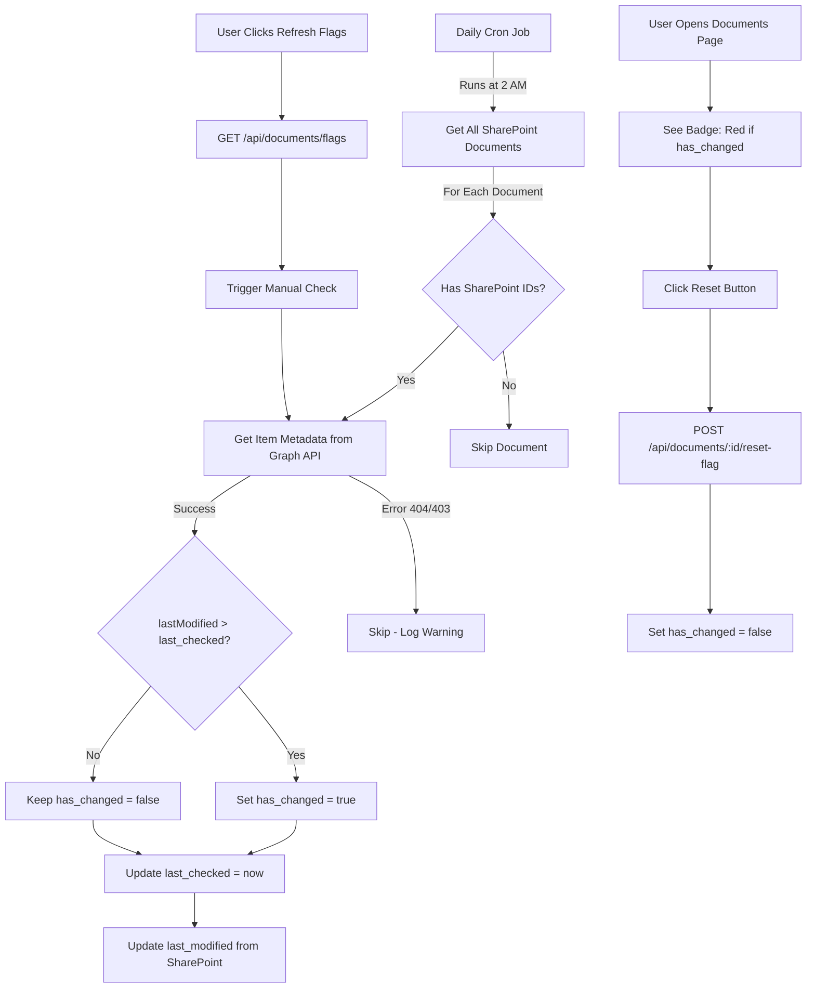

# SharePoint Change Detection S

ystem

## Overview

Add a simple daily change detection system that flags SharePoint documents modified since the last check. Users can see flags in the UI and manually reset them. The system uses existing Graph API integration and runs once per day.

## Architecture




## Implementation Plan

### 1. Database Schema Changes

**File**: `backend/prisma/schema.prisma`Add three fields to the `Document` model:

- `hasChanged` (Boolean, default: false) - Flag indicating document changed since last check
- `lastChecked` (DateTime, nullable) - Timestamp of last SharePoint check
- `lastModified` (DateTime, nullable) - SharePoint's last modified date

**Migration**: Create migration to add these fields with default values.

### 2. Daily Check Job Service

**File**: `backend/src/services/documentChangeService.ts` (new)Create a service that:

- Gets app-only access token using existing `getAppOnlyAccessToken()` from `sharePointService`
- Fetches all documents with SharePoint storage location
- For each document, calls `getSharePointItem()` to get `lastModifiedDateTime`
- Compares with `lastChecked` date
- Updates database: `hasChanged`, `lastChecked`, `lastModified`
- Handles errors gracefully (404, 403, network errors) - logs and continues
- Uses batch processing for 1000+ documents efficiently

**Key Functions**:

- `checkDocumentChanges()` - Main function to check all documents
- `checkSingleDocument()` - Check one document (for manual refresh)
- Uses existing `getSharePointItem()` from `sharePointService.ts`

### 3. Scheduled Job Setup

**File**: `backend/src/jobs/documentChangeJob.ts` (new)Create a cron job using `node-cron`:

- Runs daily at 2 AM (configurable)
- Calls `checkDocumentChanges()` from the service
- Logs start/end/completion status
- Handles errors without crashing the server

**File**: `backend/src/index.ts`Import and initialize the job when server starts:

```typescript
import { startDocumentChangeJob } from './jobs/documentChangeJob';
// ... after server starts
startDocumentChangeJob();
```

**Dependency**: Add `node-cron` and `@types/node-cron` to `backend/package.json`

### 4. API Endpoints

**File**: `backend/src/routes/documents.ts`Add two new endpoints:

#### GET /api/documents/flags

- Refreshes flags for all documents (or optionally filtered set)
- Calls `checkDocumentChanges()` service
- Returns summary: `{ checked: number, changed: number, errors: number }`
- Requires ADMIN or EDITOR role
- Rate limited to prevent abuse

#### POST /api/documents/:id/reset-flag

- Resets `hasChanged` to false for a single document
- Updates `lastChecked` to now
- Returns updated document
- Requires authenticated user (any role can reset flags they see)

### 5. Frontend: Document Interface Updates

**File**: `frontend/src/pages/DocumentsPage.tsx`Update the `Document` interface to include:

```typescript
hasChanged?: boolean;
lastChecked?: string | null;
lastModified?: string | null;
```


### 6. Frontend: UI Components

**File**: `frontend/src/pages/DocumentsPage.tsx`Add to the documents table:

- **Change Status Column**: Badge showing:
- Red "Changed" badge if `hasChanged === true`
- Green "Current" badge if `hasChanged === false` or null
- Gray "Not Checked" if `lastChecked === null`
- **Reset Button**: Icon button next to badge (only shown when `hasChanged === true`)
- Calls `POST /api/documents/:id/reset-flag`
- Updates local state after success
- Shows toast notification
- **Filter**: Add "hasChanged" filter option in filter config
- Options: "All", "Changed Only", "Current Only"
- **Refresh Flags Button**: Button in toolbar (for ADMIN/EDITOR)
- Calls `GET /api/documents/flags`
- Shows loading state
- Displays summary toast after completion

### 7. Type Updates

**File**: `frontend/src/utils/documentForm.ts`Update `Document` interface to include the three new fields.

### 8. Error Handling

- **Missing SharePoint IDs**: Skip document, log warning
- **404 (File Not Found)**: Skip document, log warning, don't set flag
- **403 (Permission Denied)**: Skip document, log warning, don't set flag
- **Network Errors**: Retry once, then skip and log
- **Token Expiration**: Job uses app-only token which auto-refreshes via cache

### 9. Testing Considerations

**Backend Tests** (`backend/src/services/__tests__/documentChangeService.test.ts`):

- Test `checkSingleDocument()` with valid SharePoint item
- Test comparison logic (newer vs older dates)
- Test error handling (404, 403, network errors)
- Test batch processing with 1000+ documents
- Test app-only token usage

**Backend Tests** (`backend/src/routes/__tests__/documents.test.ts`):

- Test GET `/api/documents/flags` endpoint
- Test POST `/api/documents/:id/reset-flag` endpoint
- Test authorization (ADMIN/EDITOR required for flags endpoint)
- Test rate limiting

**Frontend Tests** (`frontend/src/pages/__tests__/DocumentsPage.test.tsx`):

- Test badge rendering (red/green/gray states)
- Test reset button functionality
- Test filter by hasChanged
- Test refresh flags button

## Files to Modify

1. `backend/prisma/schema.prisma` - Add 3 fields to Document model
2. `backend/src/services/documentChangeService.ts` - New service file
3. `backend/src/jobs/documentChangeJob.ts` - New job file
4. `backend/src/index.ts` - Initialize job on startup
5. `backend/src/routes/documents.ts` - Add 2 new endpoints
6. `backend/package.json` - Add node-cron dependency
7. `frontend/src/pages/DocumentsPage.tsx` - Add UI components
8. `frontend/src/utils/documentForm.ts` - Update Document interface

## Migration Strategy

1. Add database fields with migration
2. Deploy backend with new service and job
3. Job will start checking documents on next scheduled run (or can be triggered manually)
4. Deploy frontend with UI updates
5. Existing documents will have `hasChanged = false`, `lastChecked = null` initially
6. First daily run will populate `lastChecked` and `lastModified` for all SharePoint documents

## Performance Considerations

- **Batch Processing**: Process documents in batches of 50-100 to avoid overwhelming Graph API
- **Rate Limiting**: Graph API has rate limits - add delays between batches if needed
- **Error Recovery**: Continue processing even if individual documents fail
- **Token Caching**: Reuse app-only token across all checks (already implemented in sharePointService)
- **Database Updates**: Use batch updates where possible (Prisma `updateMany` for bulk operations)

## Success Criteria

- Daily job runs successfully at 2 AM
- Flags correctly show SharePoint changes next day
- Users can clear flags with one click
- Works for 1000+ documents without issues