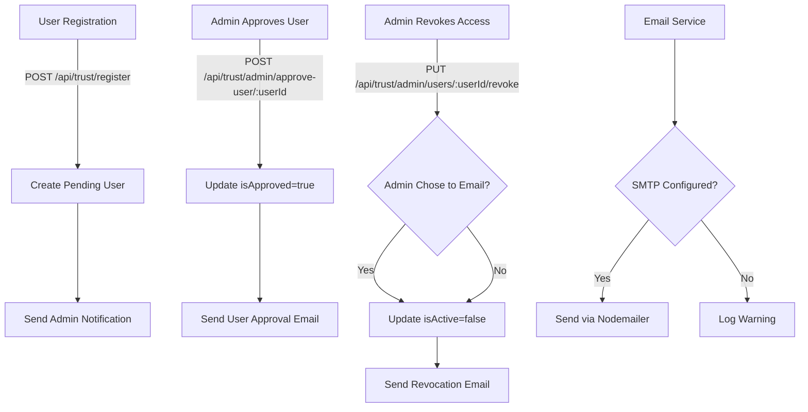

# Trust Center Email Notification System

## Overview

Implement email notifications for trust center user management events:

1. **User approval notification**: Email sent to user when their account is approved
2. **Access revocation notification**: Optional email sent to user when their access is revoked (admin choice)
3. **New pending request notification**: Email sent to system administrators when a new registration is created

## Architecture

## Implementation Details

### 1. Email Service (`backend/src/services/emailService.ts`)

Create a new email service that:

- Initializes nodemailer transporter using config from `config.email`
- Provides helper functions to get admin email addresses
- Sends HTML-formatted emails with graceful degradation (logs warning if SMTP not configured)
- Includes email template functions for each notification type

**Key Functions:**

- `isEmailConfigured()`: Check if SMTP settings are present
- `getAdminEmails()`: Query User model for ADMIN role users
- `sendEmail(to, subject, html)`: Core email sending function
- `sendUserApprovalEmail(userEmail, companyName)`: User approval notification
- `sendAccessRevokedEmail(userEmail, companyName)`: Access revocation notification
- `sendNewPendingRequestEmail(adminEmails, userEmail, companyName)`: Admin notification

### 2. Update Registration Endpoint (`backend/src/routes/trust/auth.ts`)

**Location**: Line 79-96 (after user creation)

After creating the pending user, call `sendNewPendingRequestEmail()` to notify admins. Handle errors gracefully - don't fail registration if email fails.

### 3. Update Approval Endpoint (`backend/src/routes/trust/index.ts`)

**Location**: Line 773 (replace TODO comment)

After approving the user, call `sendUserApprovalEmail()` to notify the user. Replace the TODO comment with actual email sending logic.

### 4. Update Revocation Endpoint (`backend/src/routes/trust/index.ts`)

**Location**: Line 1020-1071

Add optional `sendEmail` boolean parameter to request body. If `true`, call `sendAccessRevokedEmail()` after revoking access.

### 5. Update Frontend Revocation UI (`frontend/src/pages/TrustCenterAdminPage.tsx`)

**Location**: Line 398-422 (`handleRevokeAccess` function)

Add a confirmation dialog with a checkbox option: "Send notification email to user". Pass this choice to the API call.

### 6. Update Frontend API Service (`frontend/src/services/trustApi.ts`)

**Location**: Line 293-296 (`revokeUserAccess` function)

Update to accept optional `sendEmail` parameter in the request body.

## Email Templates

All emails should be HTML-formatted with:

- Professional styling (inline CSS for email compatibility)
- Clear subject lines
- Actionable content
- Trust center branding

**Approval Email:**

- Subject: "Your Trust Center Access Has Been Approved"
- Content: Welcome message, login instructions, link to login page

**Revocation Email:**

- Subject: "Your Trust Center Access Has Been Revoked"
- Content: Notification of revocation, contact information for support

**New Pending Request Email:**

- Subject: "New Trust Center Access Request"
- Content: User details (email, company), link to admin approval page

## Error Handling

- Email failures should not block the primary operation (user creation, approval, revocation)
- Log all email attempts and failures using existing logging infrastructure
- If SMTP is not configured, log a warning and continue (graceful degradation)

## Testing Considerations

- Unit tests for email service functions
- Integration tests for email sending (with mock SMTP)
- Test graceful degradation when SMTP not configured
- Test admin email retrieval

## Files to Modify

1. `backend/src/services/emailService.ts` (new file)
2. `backend/src/routes/trust/auth.ts` (add admin notification on registration)
3. `backend/src/routes/trust/index.ts` (add approval email, add optional revocation email)
4. `frontend/src/pages/TrustCenterAdminPage.tsx` (add email checkbox to revocation dialog)
5. `frontend/src/services/trustApi.ts` (update revokeUserAccess to accept sendEmail parameter)

## Dependencies

- `nodemailer` (already installed)
- `@types/nodemailer` (already installed)
- Existing `config.email` configuration
- Prisma client for querying admin users